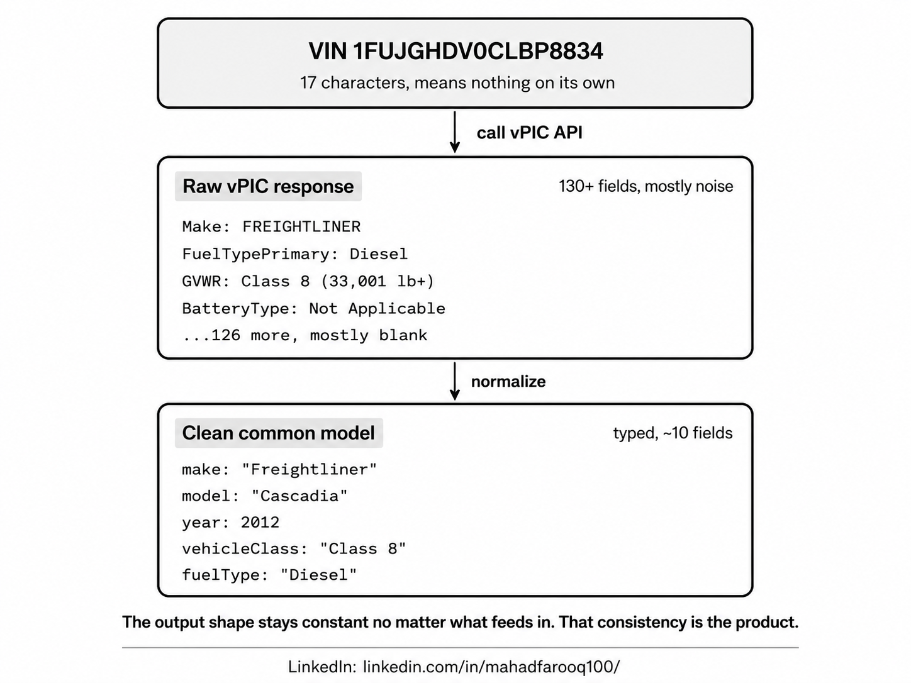

# VIN Decoder

Decode a VIN against the free NHTSA **vPIC** API and watch ~150 noisy, loosely-typed raw fields collapse into one clean, strongly-typed `Vehicle` "common model."

This mirrors how a telematics API company builds data enrichments: ingest a messy external source and reshape it into a single, consistent, typed contract its consumers can rely on. **The normalization layer is the point** — everything else is plumbing.



## The common model (the contract)

Every consumer codes against this typed shape, never against raw vPIC:

```ts
interface Vehicle {
  vin: string;
  make: string | null;
  model: string | null;
  year: number | null;
  vehicleType: string | null;       // from VehicleType
  bodyClass: string | null;         // from BodyClass, e.g. "Truck-Tractor"
  gvwrClass: string | null;         // parsed from GVWR, e.g. "Class 8"
  gvwrRange: string | null;         // the raw GVWR range text
  fuelTypePrimary: string | null;
  fuelTypeSecondary: string | null;
  driveType: string | null;
  engineCylinders: number | null;
  displacementL: number | null;
  manufacturer: string | null;      // from Manufacturer
  plantCountry: string | null;
  doors: number | null;
  errorCode: string | null;         // vPIC ErrorCode — data-quality signal
  errorText: string | null;         // vPIC ErrorText
}
```

The single pure function [`normalize(raw, vin)`](lib/normalize.ts) owns every rule:

- **Empties → `null`.** `""`, `"Not Applicable"`, and whitespace-only values collapse to `null`. `"0"` is deliberately kept — vPIC uses ErrorCode `"0"` to mean a clean decode.
- **Typed coercion.** `ModelYear`, `Doors`, `EngineCylinders` → numbers; `DisplacementL` → float. Absent/non-numeric → `null`, never `NaN`.
- **GVWR parsing.** `"Class 8: 33,001 lb and above (…)"` splits into `gvwrClass` (`"Class 8"`) plus the full original `gvwrRange` text.
- **Quality preserved.** `errorCode` / `errorText` are always carried through so consumers can judge data quality themselves.

> **Note on field names:** vPIC's flat `DecodeVinValues` response uses `Manufacturer` (not `ManufacturerName`). Verified against a live response; `normalize` falls back to `ManufacturerName` just in case.

## Run locally

```bash
npm install
npm run dev      # http://localhost:3000
npm test         # unit tests for the normalization layer
npm run build    # production build
```

No API key, no registration, no rate limit — vPIC is free and keyless.

## Deploy to Vercel

Zero config. Push to a Git repo and import it on Vercel, or:

```bash
npx vercel
```

There are no environment variables to set.

## API

| Method | Route                | Body / Query             | Returns |
| ------ | -------------------- | ------------------------ | ------- |
| `GET`  | `/api/decode`        | `?vin=XXXXXXXXXXXXXXXXX` | `{ vin, vehicle, raw, rawFieldCount, cleanFieldCount }` |
| `POST` | `/api/decode/batch`  | `{ "vins": string[] }`   | `{ results: DecodeResult[] }` |

- Invalid VINs return **400** with a readable JSON error (`{ error }`).
- vPIC / network failures return **502** with a readable message.
- In a batch, invalid VINs become inline error entries rather than failing the whole request.

## Example VINs

The demo ships three VINs, each verified to decode against the live API:

| Type          | VIN                 | Decodes to              |
| ------------- | ------------------- | ----------------------- |
| Heavy truck   | `1FUJGLDR5CLBP8834` | Freightliner Cascadia (Class 8) |
| Pickup        | `1FTFW1ET5DFC10312` | Ford F-150              |
| Passenger car | `1HGCM82633A004352` | Honda Accord            |

## Project structure

```
lib/
  vpic.ts            fetch wrapper for vPIC (single + batch) + RawVpicResult type
  normalize.ts       the Vehicle contract + the normalize() function (the centerpiece)
  validateVin.ts     17-char VIN validation (excludes I, O, Q)
  decode.ts          shared decode types + orchestration (one source of truth)
  normalize.test.ts  unit tests (Node's built-in runner — no extra deps)
app/
  api/decode/route.ts        GET  single decode
  api/decode/batch/route.ts  POST batch decode
  components/                 UI (decoder, vehicle card, raw-vs-clean, batch table)
  page.tsx                   demo page
```

## Stack

Next.js (App Router) · TypeScript (strict, no `any`) · Tailwind CSS. The unit test uses Node's built-in test runner with experimental TS type-stripping, so there are **no test-framework dependencies**.

---

Data source: [U.S. NHTSA vPIC API](https://vpic.nhtsa.dot.gov/api/). This is a portfolio demo.

Created by [Mahad Farooq](https://www.linkedin.com/in/mahadfarooq100/).
